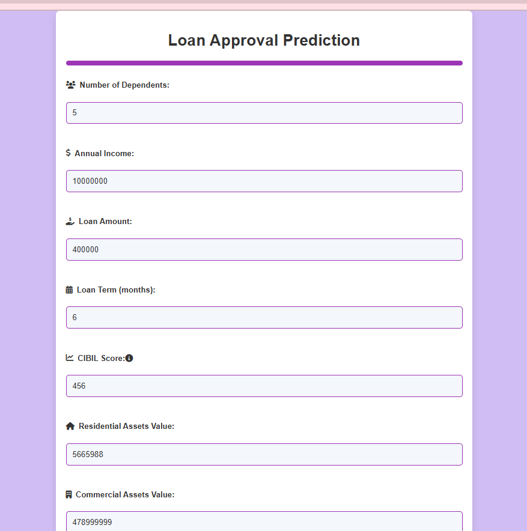

# Loan-Approval-Prediction
This project is a web application for predicting loan approval status based on various financial and personal attributes. It uses a machine learning model that I trained on historical loan data to make predictions. I built the web application using Flask for the web framework, SQLite for the database, and the pre-trained model saved with joblib.

The following machine learning models were explored and evaluated for the prediction task:

- Logistic Regression
- Decision Tree
- Random Forest
- Gradient Boosting
- Support Vector Machine

# Features
- Predicts loan approval status based on user input.
- Utilizes a machine learning model trained on historical loan data.
- Provides a user-friendly interface for inputting loan application details.
- Stores client information and prediction results in a SQLite database.

## More Information

Please go through [Loan_Prediction](LoanPrediction.pptx) for more information.

